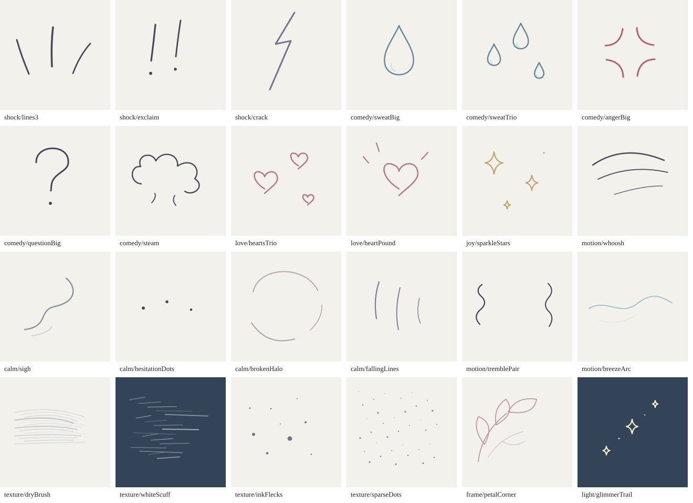
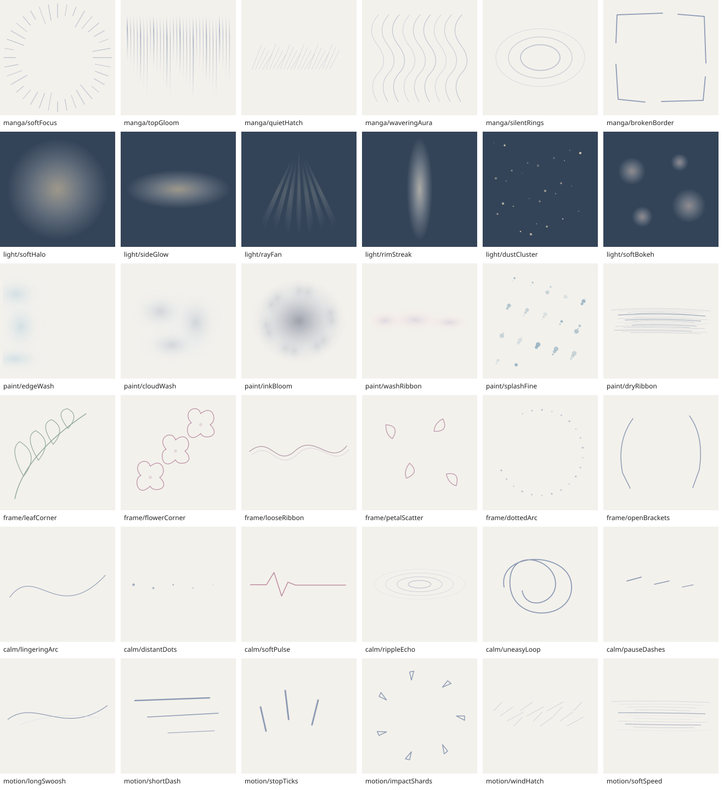
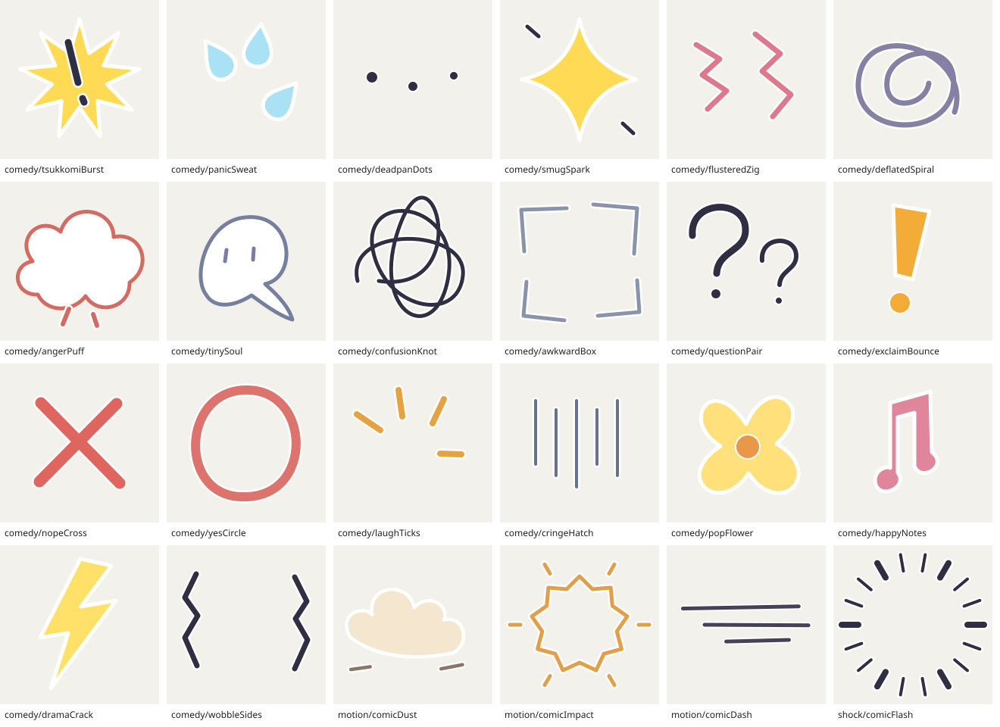

# 漫画素材の追加ガイド

AI Paste Effect の漫画素材（驚き線・汗・ハートなど）は、**ファイルをリポジトリに置くだけ**でアプリに自動で取り込まれます。
このページは、人や AI（ChatGPT など）が素材を作って追加するための説明です。

## 置き場所とファイル名

```
src/assets/<セット名>/svg/<グループ>-<名前>.svg      ← 色を変えられるベクター素材（おすすめ）
src/assets/<セット名>/img/<グループ>-<名前>.png      ← 画像素材（PNG / WebP。色は変えられない）
src/assets/<セット名>/pack.json                       ← セットの名前・作者・ライセンス（任意）
```

- ファイル名の最初の `-` までがグループ、残りが名前になり、素材 ID は `<グループ>/<名前>` になります
  - 例: `src/assets/my-pack/svg/comedy-sweatBig.svg` → 素材 ID `comedy/sweatBig`
- **既存の素材と同じ ID にすると「同じ意味の別の絵」**になり、ユーザーが設定や編集タブで絵柄を切り替えられます
  - 例: 標準セット（`manga`）の `comedy/sweatBig` に対して、`my-pack` にも `comedy-sweatBig.svg` を置く
- **新しい ID にすると新しい素材**として、AI 向けの素材カタログにも自動で載ります
- 使っているグループ: `shock`（驚き・衝撃）/ `gloom`（落ち込み・不穏）/ `comedy`（コミカル）/ `love`（恋）/ `joy`（喜び）/ `motion`（勢い）。新しいグループも作れます

## SVG の書き方

```svg
<svg xmlns="http://www.w3.org/2000/svg" viewBox="0 0 200 200"
     data-label="大きな汗（焦り・気まずさ。頭の横に）"
     data-tags="comedy,awkward"
     data-size="0.2"
     data-colors="#bfe6ff,#2f6db0"
     data-author="あなたの名前"
     data-license="MIT">
  <path d="..." fill="__C1__" stroke="__C2__" stroke-width="6"/>
</svg>
```

- **viewBox を必ず指定**してください。正方形なら `0 0 200 200`、横長なら `0 0 320 120` など。絵の中心を viewBox の中心に置いてください。アプリは素材の中心を指定位置に合わせ、幅を `size` に拡大縮小し、縦横比を維持します
- 色は `__C1__`（主色）と `__C2__`（副色・縁取り）と書くと、AI やユーザーが色を変えられます。固定の色を書いてもかまいません
- 背景は透明のままにしてください（四角い背景を塗らない）
- `data-*` 属性はすべて任意です
  - `data-label`: AI 向けの一言説明（どんな時に、どこに置く素材か）
  - `data-tags`: タグ（カンマ区切り）
  - `data-size`: 推奨の大きさ（画像の短辺に対する比。0.1〜0.6 くらい）
  - `data-colors`: `__C1__`,`__C2__` の既定色
  - `data-author`, `data-license`: 作者とライセンス
- `<script>` や外部ファイルの読み込みは使わないでください（画像として描くので動きません）

## pack.json（任意）

```json
{ "name": "やわらか手描きセット", "author": "あなたの名前", "license": "MIT" }
```

設定画面の「漫画素材のセット」にこの名前で表示されます。

## ライセンスについて

- 自作の素材、または **CC0 / MIT など再配布できるライセンス**の素材だけを追加してください
- ネット上で拾った画像や、著作権のあるキャラクター・ロゴは入れないでください
- 作者とライセンスは `data-author` / `data-license` か `pack.json` に必ず書いてください

## 反映のされ方

ファイルを `main` ブランチに追加すると、GitHub Actions が自動でビルドして公開ページに反映されます。
アプリのコードを変更する必要はありません。

## 繊細な手描き・余韻セット（manga-delicate）

細線・輪郭中心の24点（既存IDの描き分け12点＋新規ID12点）です。



設定の「漫画素材のセット」で「繊細な手描き・余韻セット」を選ぶと、
既存の驚き線・汗・ハートなども細線版で描かれます。
個別レイヤーの `pack: "manga-delicate"` でも指定できます。
新規IDは自動でAI向けカタログに載り、標準セットのままでも使えます。

| 新規ID | 用途 |
| --- | --- |
| calm/sigh | 口の横の余白に置くため息線 |
| calm/hesitationDots | ためらいの段違いの点 |
| calm/brokenHalo | 途切れた柔らかな輪 |
| calm/fallingLines | 力なく下がる落胆線 |
| motion/tremblePair | 震えの波線 |
| motion/breezeArc | 穏やかな風の弧 |
| texture/dryBrush | 乾いた筆のかすれ |
| texture/whiteScuff | 暗い背景用の白いかすれ |
| texture/inkFlecks | 疎らなインク飛沫 |
| texture/sparseDots | 背景用の疎らな点描 |
| frame/petalCorner | 角に置く抽象的な花びらの縁飾り |
| light/glimmerTrail | 光源側へ置くきらめきの軌跡 |

背景用の質感は低い `opacity` から始め、顔・髪・肌を保護してください。
白いかすれときらめきは暗い背景で見えやすく、風や筆跡は透明な余白を含む
正方形素材です。人物の後ろへの自動配置や人物の切り抜きは行いません。
再生成は `node scripts/gen-delicate-assets.mjs`。既存セットは上書きしません。


## 光・にじみ・背景演出セット（atmosphere）



36種類の新規素材を収録。漫画背景・光・水彩風のにじみ・縁飾り・静かな感情・動きの
6群を各6点用意しました。新規IDは標準セットでも使えます。
光は `screen`、陰影や筆跡は `multiply`、淡いにじみは `soft-light` と低い `opacity` から試してください。
SVGの色は変更できます。暗い背景へ黒系の細線を重ねる場合は主色を明るくしてください。
にじみはSVGのグラデーションによる柔らかな表現で、元の絵の描き直しや実際の絵の具の物理シミュレーションは行いません。

- 素材を再生成: `node scripts/gen-atmosphere-assets.mjs`
- 一覧を再生成: `node scripts/gen-asset-preview.mjs atmosphere`
- 全5セット合計116ファイル、意味として98種類（同じIDの絵柄違いを含む）
- 横長・縦長SVGと画像の比率を維持。既存の正方形素材の配置・サイズはそのまま
- 素材読み込み後の一時Blob URLを解放。WebPをPWAの事前キャッシュ対象に追加

第一弾24点は公開アプリでJSON貼り付け・画像読み込み・描画を確認済み。
素材追加時は、一覧での見た目確認に加え、明暗の違う背景での描画と顔保護も確認してください。


## ぽんっとコメディ漫画セット（manga-comedy）



太い線と白い縁取りの新規24点。ツッコミ・飛び散る汗・真顔の間・ドヤッの星・
焦り線・脱力の渦・魂・混乱線・丸バツ・笑い線・土煙などを収録します。
設定でこのセットを選ぶか、`illustrationOverlay` / `reactionScene` の `pack` に
`manga-comedy` を指定できます。収録されていない素材IDは従来どおり別セットへフォールバックします。

`reactionScene` に以下の6種を追加しました（既存10種も利用可能）。

| kind | 組み合わせ |
| --- | --- |
| tsukkomi | ギザギザ衝撃＋大小の疑問符 |
| panic | 飛び散る汗＋感嘆符＋頭上の混乱線 |
| deadpan | 間の点3つ＋小さな気まずい縦線 |
| smug | 太いきらめき＋丸印 |
| flustered | 焦りのジグザグ＋飛び散る汗 |
| deflated | 脱力の渦＋顔の外へ置く漫画記号の魂 |

顔の中心 `face` と顔幅 `faceSize` に合わせ、記号は顔の左右・頭上の余白へ配置します。
顔は `protect` に指定してください。`side` で記号を置く側を指定できます。
文字を使わないプリセットなので、追加フォントの読み込みなしで利用できます。
`pack` はプリセット内のすべての素材へ反映され、素材セットを明示した演出を共有できます。

- 再生成: `node scripts/gen-comedy-assets.mjs`
- 一覧再生成: `node scripts/gen-asset-preview.mjs manga-comedy`
- [6種の演出JSON例](comedy-scenes.json)（faceは一般的な配置。使う画像に合わせてAIに修正してもらってください）
- 全5セットで116ファイル、絵柄違いを除く98種類。エフェクトの種類数は60のまま、演出プリセットは16種類
